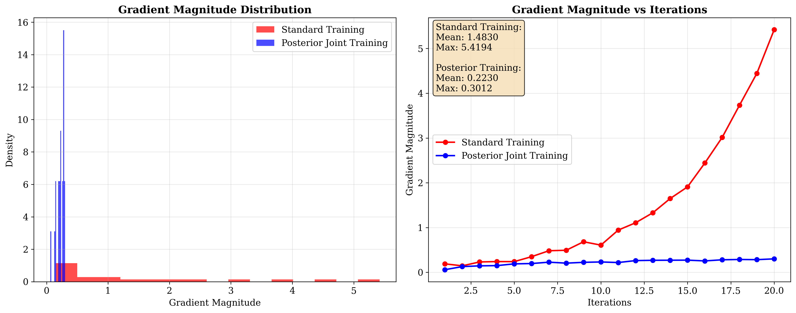
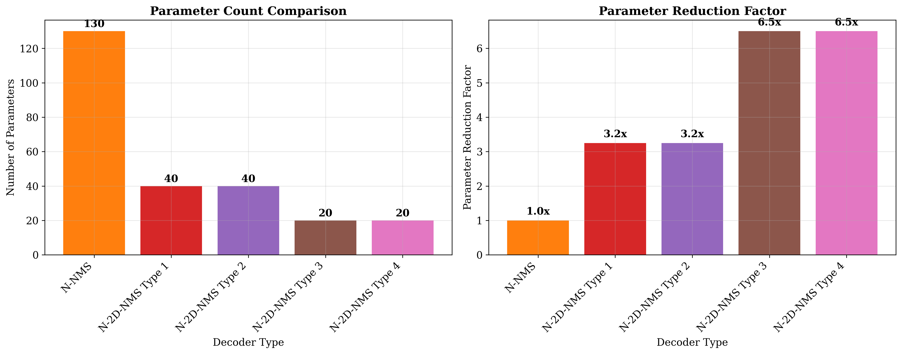

# LDPC Decoding with Degree-Specific Neural Message Weights and RCQ Decoding

This repository implements the algorithms and methods described in the paper:

**"LDPC Decoding with Degree-Specific Neural Message Weights and RCQ Decoding"**  
*Linfang Wang, Caleb Terrill, Richard Wesel, and Dariush Divsalar*  
arXiv:2310.15483v2 [eess.SP] 5 Dec 2023

## Overview

This implementation provides a comprehensive framework for neural LDPC decoding with the following key features:

- **Basic MinSum Decoder**: Traditional LDPC decoder implementation
- **Neural 2D MinSum Decoder**: Neural network-enhanced MinSum decoder with node-degree-based weight sharing
- **RCQ Decoder**: Reconstruction-Computation-Quantization decoder for low-bitwidth decoding
- **Weighted RCQ Decoder**: Combination of neural weights with RCQ quantization
- **Training Framework**: Posterior joint training to address gradient explosion
- **Simulation Framework**: Comprehensive performance evaluation tools

<p align="center">
  
  
</p>

*Figure 1: FER and BER performance comparison across different decoders.*

---

## Key Contributions Implemented

### 1. Node-Degree-Based Weight Sharing
- **Type 1**: Same weight for edges with same check node degree AND variable node degree
- **Type 2**: Separate weights for check node degree and variable node degree  
- **Type 3**: Only check node degree based weights
- **Type 4**: Only variable node degree based weights

<p align="center">
  
</p>

*Figure 2: Visualization of learned weight evolution across iterations and node degrees.*

---

### 2. Posterior Joint Training
- Addresses gradient explosion issues in neural LDPC decoder training
- Uses only posterior information for gradient computation
- Prevents large-magnitude gradients from propagating to preceding layers

<p align="center">
  
</p>

*Figure 3: Gradient magnitude analysis — posterior joint training vs. standard training.*

---

### 3. RCQ Decoding
- Non-uniform quantization with power function thresholds
- Dynamic quantizer/dequantizer pairs
- Low-bitwidth message passing with excellent performance

### 4. Weighted RCQ Decoder
- Combines neural weights with RCQ quantization
- Reduces hardware requirements compared to standard RCQ
- Maintains comparable performance with fewer quantizer pairs

---

## File Structure

```
├── ldpc_decoder.py          # Basic LDPC decoder and code structure
├── neural_minsum_decoder.py # Neural MinSum decoder with edge-specific weights
├── neural_2d_decoder.py     # Neural 2D MinSum and Offset MinSum decoders
├── rcq_decoder.py           # RCQ and Weighted RCQ decoders
├── training_framework.py    # Training framework with posterior joint training
├── simulation_framework.py  # Performance evaluation and simulation tools
├── examples.py              # Comprehensive examples and test cases
├── comprehensive_test.py    # Comprehensive test script for all decoders
├── ieee_report.tex          # IEEE-style LaTeX report
└── README.md               # This file
```

## Installation

### Requirements
- Python 3.7+
- PyTorch 1.8+
- NumPy
- Matplotlib
- Logging (built-in)

### Install Dependencies
```bash
pip install torch numpy matplotlib
```

## Quick Start

### Basic Usage

```python
from ldpc_decoder import create_test_ldpc_code, BasicMinSumDecoder, simulate_awgn_channel
import numpy as np

# Create LDPC code
code = create_test_ldpc_code()

# Create decoder
decoder = BasicMinSumDecoder(code, factor=0.7)

# Test codeword
codeword = np.zeros(code.n, dtype=int)

# Simulate channel
llr = simulate_awgn_channel(codeword, snr_db=2.0)

# Decode
decoded, success, iterations = decoder.decode(llr)
print(f"Success: {success}, Iterations: {iterations}")
```

### Neural MinSum Decoder

```python
from neural_minsum_decoder import NeuralMinSumDecoder
import torch

# Create neural decoder with edge-specific weights
decoder = NeuralMinSumDecoder(code, max_iterations=10)

# Decode
llr_tensor = torch.tensor(llr, dtype=torch.float32)
decoded, posterior, iterations = decoder(llr_tensor)
print(f"Decoded: {decoded.numpy()}")
print(f"Parameters: {len(decoder.beta_weights)}")
```

### Neural 2D MinSum Decoder

```python
from neural_2d_decoder import Neural2DMinSumDecoder
import torch

# Create neural decoder with weight sharing
decoder = Neural2DMinSumDecoder(code, weight_sharing_type=2, max_iterations=10)

# Decode
llr_tensor = torch.tensor(llr, dtype=torch.float32)
decoded, posterior, iterations = decoder(llr_tensor)
print(f"Decoded: {decoded.numpy()}")
```

### RCQ Decoder

```python
from rcq_decoder import RCQMinSumDecoder

# Create RCQ decoder
quantizer_params = [(3.0, 1.3), (5.0, 1.3), (7.0, 1.3)]
rcq_decoder = RCQMinSumDecoder(code, bc=3, bv=8, quantizer_params=quantizer_params)

# Decode
decoded, success, iterations = rcq_decoder.decode(torch.tensor(llr))
```

## Examples

Run the comprehensive examples:

```bash
python examples.py
```

Run a quick test:

```bash
python examples.py quick
```

Run comprehensive test of all decoders:

```bash
python comprehensive_test.py
```

## Training

### Train a Neural Decoder

```python
from training_framework import TrainingConfig, PosteriorJointTrainer
from neural_2d_decoder import Neural2DMinSumDecoder

# Create model
model = Neural2DMinSumDecoder(code, weight_sharing_type=2, max_iterations=10)

# Training configuration
config = TrainingConfig(
    batch_size=32,
    num_epochs=100,
    learning_rate=0.001,
    snr_range=(0.0, 6.0),
    use_posterior_training=True
)

# Create trainer
trainer = PosteriorJointTrainer(model, config)

# Train
history = trainer.train(code, num_train_samples=1000, num_val_samples=200)
```

## Simulation

### Performance Evaluation

```python
from simulation_framework import SimulationConfig, LDPSimulator

# Simulation configuration
config = SimulationConfig(
    snr_range=(0.0, 6.0),
    snr_step=0.5,
    max_frames=10000,
    max_errors=100
)

# Create simulator
simulator = LDPSimulator(config)

# Create decoders
decoders = {
    'Basic MinSum': BasicMinSumDecoder(code, factor=0.7),
    'N-2D-NMS Type 2': Neural2DMinSumDecoder(code, weight_sharing_type=2),
    'RCQ MinSum': RCQMinSumDecoder(code, bc=3, bv=8, quantizer_params=[(3.0, 1.3)])
}

# Run simulation
results = simulator.simulate_multiple_decoders(decoders, code)

# Plot results
simulator.plot_fer_curves(results)
simulator.plot_ber_curves(results)
```

## Weight Sharing Types

The implementation supports four different weight sharing schemes:

| Type | Description | Parameters per Iteration |
|------|-------------|-------------------------|
| 1 | Same weight for same (check_degree, variable_degree) pairs | ~13 |
| 2 | Separate weights for check degree and variable degree | ~8 |
| 3 | Only check node degree based weights | ~4 |
| 4 | Only variable node degree based weights | ~4 |

## RCQ Quantization

The RCQ decoder uses non-uniform quantization with power function thresholds:

```
τ_j = C * (j / (2^bc - 1))^γ
```

Where:
- `C`: Maximum magnitude parameter
- `γ`: Non-uniformity parameter (γ=1 gives uniform quantization)
- `bc`: Number of bits for quantization

## Performance Results

<p align="center">   </p>

Figure 4: Frame Error Rate (FER) and Bit Error Rate (BER) performance comparison.

Based on the paper's results:

- **N-2D-NMS Type 2** achieves similar performance to full neural MinSum with only 8 parameters per iteration
- **W-RCQ decoder** delivers comparable FER performance to 5-bit OMS decoder with reduced hardware requirements
- **Posterior joint training** effectively addresses gradient explosion issues

## Hardware Considerations

The implementation is designed with hardware efficiency in mind:

- **Weight sharing** reduces memory requirements
- **RCQ quantization** enables low-bitwidth implementations
- **Posterior training** prevents gradient explosion for stable training

## Testing

Run comprehensive tests:

```python
# Test basic functionality
python examples.py quick

# Run all examples
python examples.py

# Test individual modules
python ldpc_decoder.py
python neural_2d_decoder.py
python rcq_decoder.py
python training_framework.py
python simulation_framework.py
```

## Visual Summary

<p align="center">
  
  
  
</p>
<p align="center">
  
  
</p>

*Figure 6: Summary of key analysis plots used in the IEEE report.*


## Citation

If you use this implementation, please cite the original paper:

```bibtex
@article{wang2023ldpc,
  title={LDPC Decoding with Degree-Specific Neural Message Weights and RCQ Decoding},
  author={Wang, Linfang and Terrill, Caleb and Wesel, Richard and Divsalar, Dariush},
  journal={arXiv preprint arXiv:2310.15483v2},
  year={2023}
}
```

## License

This implementation is provided for research and educational purposes. Please refer to the original paper for theoretical details and experimental results.

## Contributing

Contributions are welcome! Please feel free to submit issues, feature requests, or pull requests.

## Acknowledgments


This implementation is based on the work of Linfang Wang, Caleb Terrill, Richard Wesel, and Dariush Divsalar. The original paper can be found at: https://arxiv.org/abs/2310.15483v2
